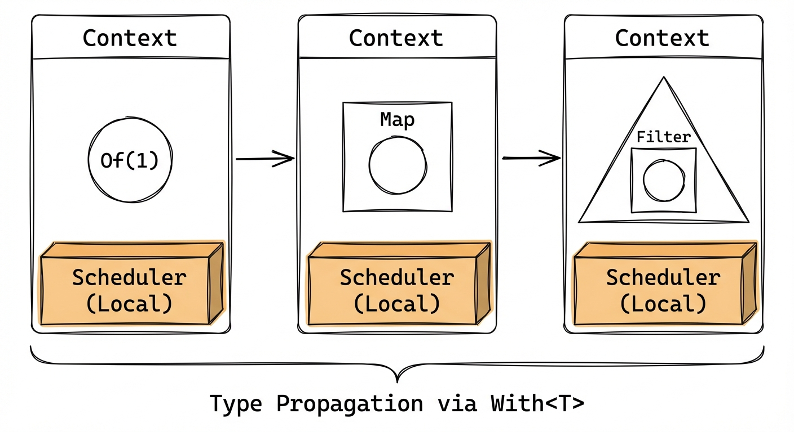

# rxRust: Reactive Extensions for Rust

[](https://docs.rs/rxrust/)
[](https://rxrust.github.io/rxRust/)
[](https://codecov.io/gh/rxRust/rxRust)
[](https://github.com/rxRust/rxRust/actions/workflows/main.yml)
[](https://crates.io/crates/rxrust)
[](https://crates.io/crates/rxrust)

**rxRust** is a zero-cost, type-safe Rust implementation of [Reactive Extensions](http://reactivex.io/).

It enables a declarative coding style for handling asynchronous events, stream processing, and concurrency, leveraging Rust's ownership system to ensure memory safety and efficient resource usage.

## 🚀 Key Features

*   **Zero-Cost Abstractions**: Heavily relies on generic specialization and monomorphization to compile down to efficient code.
*   **Pay-for-what-you-need**: Choose the right tool for the job. Use `Local` (Rc/RefCell) for single-threaded performance without locking overhead, or `Shared` (Arc/Mutex) when thread synchronization is actually required.
*   **Unified Logic, Adaptive Context**: Write your stream logic once. The same operator chains adapt seamlessly to different environments based on the context they run in.
*   **Interoperability**: Seamlessly integrates with Rust `Future`s, streams, and `async/await`.
*   **Wasm Support**: Works out of the box on WebAssembly.

## 📦 Installation

Add this to your `Cargo.toml`:

```toml
[dependencies]
rxrust = "1.0.0-rc.0"
```

## ⚡ Quick Start

rxRust v1.0 unifies its **API and implementation logic**, while the **Context** (environment) provides the most suitable resource types at compile-time. The API remains consistent regardless of whether you are in a single-threaded or multi-threaded environment.

```rust
use rxrust::prelude::*;

fn main() {
    // 🟢 Local Context: No locks, high performance for single thread
    Local::from_iter(0..10)
        .filter(|v| v % 2 == 0)
        .subscribe(|v| println!("Local Even: {}", v));

    // 🔵 Shared Context: Thread-safe, ready for concurrency
    Shared::from_iter(0..10)
        .map(|v| v * 2)
        .subscribe(|v| println!("Shared Doubled: {}", v));
}
```

## 🎯 Core Concepts

### 1. Select Your Context

The **Context** determines the execution strategy and memory management:

*   **`Local`**: **No Locking.** Uses `Rc` and `RefCell`. Ideal for UI threads, WASM, or single-threaded event loops. The compiler ensures these types don't leak across threads.
*   **`Shared`**: **Thread Safe.** Uses `Arc` and `Mutex`. Required when streams need to jump across threads or share state globally.



### 2. Schedulers & Timing

Control *when* and *where* work happens using schedulers. By default, **rxRust** schedulers rely on `tokio`. You can also disable the default `scheduler` feature to implement a custom scheduler adapted to your own runtime.

```rust
use rxrust::prelude::*;

#[tokio::main(flavor = "local")]
async fn main() {
    // Emit a value after 100ms
    Local::timer(Duration::from_millis(100))
        .subscribe(|_| println!("Tick!"));

    // Throttle a busy stream
    Local::interval(Duration::from_millis(10))
        .throttle_time(Duration::from_millis(100), ThrottleEdge::leading())
        .subscribe(|v| println!("Throttled: {}", v));
}
```

*Note: `Local` context schedulers require running within a `LocalSet` or a compatible `LocalRuntime`.*

### 3. Subjects (Multicasting)

Subjects allow you to multicast events to multiple subscribers. The `Subject` type automatically adapts its internal storage (`Rc<RefCell<...>>` vs `Arc<Mutex<...>>`) based on the context used to create it.

```rust
use rxrust::prelude::*;

// Created in a Local context, this Subject uses RefCell internally (no Mutex)
let mut subject = Local::subject();

subject.clone().subscribe(|v| println!("Observer A: {}", v));
subject.clone().subscribe(|v| println!("Observer B: {}", v));

subject.next(1);
subject.next(2);
```

## 📚 Documentation & Guide

For a deeper dive into core concepts, advanced architecture, and cookbooks, check out our **[Online Guide](https://rxrust.github.io/rxRust/)**.

*   [Getting Started](guide/getting_started.md)
*   [Core Concepts](guide/core_concepts/context.md)
*   [Advanced Architecture](guide/advanced/architecture_deep_dive.md)

## 🌙 Nightly (Experimental)

rxRust targets **stable Rust** by default.

For advanced use-cases involving **lifetime-dependent mapped outputs** (e.g. `&'a mut T -> &'a U`), `map` provides an **experimental** implementation behind the Cargo feature `nightly`.

- Enable: `rxrust = { version = "1.0.0-rc.0", features = ["nightly"] }`
- Build with: `cargo +nightly test --features nightly`

Once the relevant language support (like GATs stabilization in specific patterns) is mature, we plan to expand this support.

## 🤝 Contributing

We welcome contributions! rxRust is a community-driven project.

*   Check out [Missing Features](missing_features.md) to see what operators are needed.
*   Look for "Good First Issue" tags on GitHub.
*   Improve documentation or add examples.

## 📄 License

MIT License
